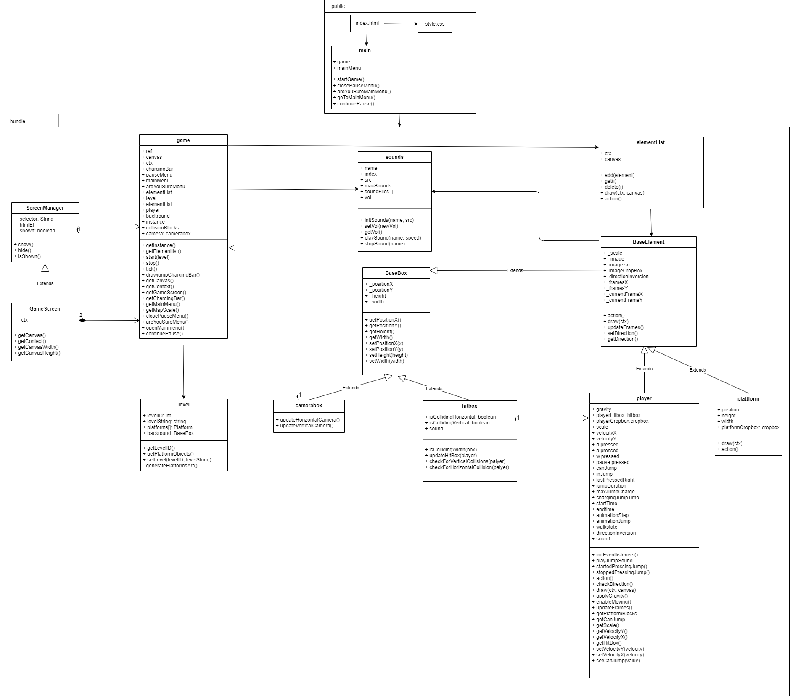

# Where Is My Wrench?

**A team-built browser game using OOP, HTML Canvas, and vanilla JavaScript**

_Played by a team of five, engineered with clean class design and event-driven UI._

<!-- Add your animated gameplay GIF here -->


---

## 🎮 What It Is

**Where Is My Wrench?** is a browser-based game developed as a university project. Built entirely in vanilla JavaScript and drawn on the HTML Canvas, the game features:

- A robust **object-oriented design**, including reusable classes and abstractions  
- A custom **window manager** for handling game states, UI overlays, and transitions via custom events  
- Team collaboration in Git with **code reviews and feedback**, leveraging each member's strengths in graphics, animation, and architecture



---

## ⚡ Getting Started

### Prerequisites
- Node.js (>= 18 recommended)  
- npm or yarn  
- Modern web browser (Chrome, Firefox, Edge, etc.)  

### Installation

1. **Clone the repository:**
   ```bash
   git clone https://github.com/ozhadykov/browsergame-v2.git
   cd browsergame-v2

