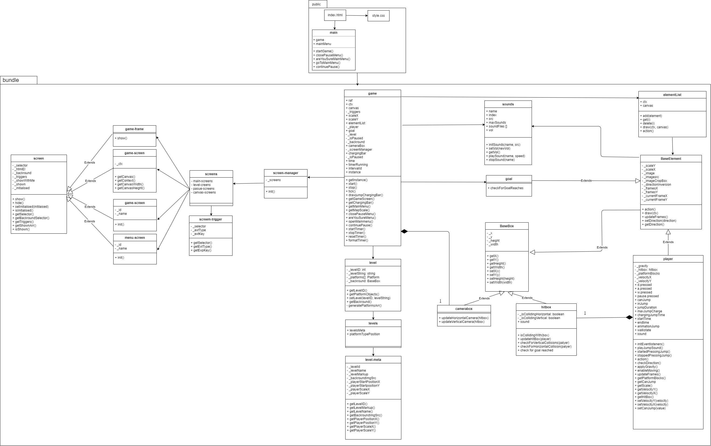

# browsergame-baseapp

The browsergame-baseapp is a tiny client-side application that may serve as a starting point to develop your own browsergame. 
It has an educational focus and provides some basic, object-oriented infrastructure. 

How to start
------------
Yes, we are now working with something fast:) Use it to install packages and modules

    npm i

go to your project directory and start it with this command, you do not need more.

    npm run dev

This is wys faster than watchify and this is used to develop apps today, I hope...

---

# **Projektplan: Browsergame - Bachelorarbeit**

---

### Aktueller Fortschritt
- **Projekteinrichtung**: Git und Entwicklungsumgebung – **Abgeschlossen**
- **Gravitation** – **Abgeschlossen**
- **Spielerbewegung** – **Fast Abgeschlossen**
- **Hintergrund (Karte)**: Soll gemalt und mit Hilfe von Tiles erstellt werden – **In Arbeit**
- **Kollisionsabfrage**:
  - Vertikale und horizontale Kollision
  - Block-Kollision
- **Spieleranimation** (falls benötigt)
- **Hitbox-Implementierung**: Grobe Kopf-Kollision für den Spieler; unser PNG ist etwas größer als das tatsächliche Spielermodell
- **Spieleranimationen**: Fortgeschrittene Animationen, z.B. Laufen, Springen usw.
- **Plattform-Kollision** – **In Arbeit**
- **Horizontale Kamerabewegung**
- **Vertikale Kamerabewegung**
- **Levelwechsel**
- **Fortschritt speichern**
- **Checkpoints einbauen**

---

### Aufgaben für die Woche (11. Nov. - 17. Nov.)
**Ziel:** Abschluss bis zum nächsten Jour Fixe

1. **Entwurf der Karte mit Tiles**  
   - **Zuständig:** Omar  
   - Erstellen eines Entwurfs für die Karte im Tile-Format.

2. **Spielerentwurf (PNG)**  
   - **Zuständig:** Simon   
   - Gestaltung eines grundlegenden PNG-Bilds für den Spieler.

3. **Hauptmenü**  
   - **Zuständig:** Paul J.
   - Entwurf des Hauptmenüs für das Spiel.

4. **Entwurf der Plattform-Kollision**  
   - **Zuständig:** Imke  
   - Vorläufiges Design für die Plattform-Kollisionsabfrage erstellen.

5. **Entwurf des Pausemenüs**
   - **Zuständig:** Paul F
   - Entwurf des Hauptmenüs für das Spiel

---

### Aufgaben (noch nicht zugeteilt)
**Ziel:** langfristig / iterativ

Idee des Objektorieterten Programmierens einearbeiten

- Prinzip des kleinsten Zugriffs
- Zusammenfügen von gemeinsamkeiten in Oberklassen (Siehe framework)

----- Gameplay

- Hud - Simon
- Hintergrund - ID 
- Kamera - ?? 
- Map in 2 Geteilt - ?? 
- Steuerung Anpassen - (fertig) 
- "Sprung Gefühl" Anpassen - ?? 

(???) Items, "lava level",

### Aufgaben für die Woche (28. Nov. - 6. Dez.)

1. Jump Balken + Limiter - Paul F
2. Main Menu Background + Buttons - Paul J
3. Background Image - Imke
4. Neue Character + Neue Animation + neues Level - Simon
5. Camera Bewegung - Omar

